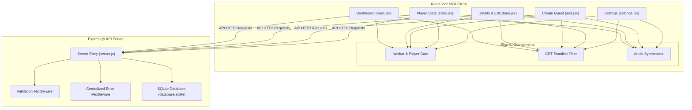

# CyberArcade Questlog (Gamified Todo Application)

A highly polished, full-stack, responsive, and gamified Todo application designed with an immersive dark-neon retro arcade cabinet theme. Built using **React (Vite Multi-Page Application)** on the frontend and **Node.js (Express.js + SQLite)** on the backend.

---

## 📸 Screenshots


* **Dashboard (Active Quests list with search, filter, and sort controls):**
  
  


* **Quest Editor & Details (Detail view and validation-guided edit mode):**
 


* **Character Sheet (Player XP progression, level-up details, and task clearance stats):**
 


* **Settings Console (Sound calibration and CRT scanline toggles):**
 

---

## 👾 Features

### 1. Retro Game Aesthetics
* **Neon-lit UI Panel:** Immersive retro styles using custom `'Share Tech Mono'` and `'Press Start 2P'` Google Fonts with glowing box-shadows and vibrant cyberpunk accents.
* **CRT Screen Scanlines:** Option to toggle fullscreen scanline animations and CRT glass glows for an authentic arcade cabinet vibe.
* **Synthesized SFX:** Uses the native browser **Web Audio API** to synthesize classic 8-bit sound effects (coin chimes, laser sweeps, select blips, error buzzers) dynamically in code (no external assets required).

### 2. Gamified Quest Progression (XP Mechanics)
* **XP Rewards:** Completing active tasks rewards the player with experience points based on difficulty:
  * **Chill (LOW):** +10 XP
  * **Normal (MEDIUM):** +20 XP
  * **High Energy (HIGH):** +50 XP
  * **Super Boss Fight (BOSS):** +100 XP
* **Dynamic Popups:** Floating "+XP" numbers fly up from checked items in real-time.
* **Level Progression:** Automatic leveling system (100 XP per level) with arcade fanfare sound and unlockable rank titles:
  * *Level 1:* Novice Adventurer ⚔️
  * *Level 2:* Code Grinder 🗺️
  * *Level 3:* Bug Slayer 🔫
  * *Level 4:* Arcade Champ 🏆
  * *Level 5+:* Legendary Hero 👑

### 3. Core Task Management (CRUD)
* **Quest Dashboard:** Display all tasks, toggle complete/incomplete, delete tasks, and visualize priority levels.
* **Granular Quest Detail Page:** Access distinct details via URL parameters (`?id=<ID>`), toggle status, or enter Edit Mode.
* **Reprogram (Edit) Mode:** Update Title, Instructions (description), Priority difficulty, and Due Date dynamically.
* **Due Dates & Overdue Alarms:** Define targets; overdue tasks flash in blinking red emergency indicators.
* **Dashboard Sorting & Filtering:** 
  * Search by title keyword.
  * Filter by Status (All, Active, Completed) or Priority (All, Low, Medium, High, Boss).
  * Sort by Creation Time (newest/oldest), Priority hierarchy, or Due Date urgency.

### 4. Code & Architecture Best Practices
* **Robust Input Validation:** Strict schema checks on titles, descriptions, and formats for API endpoints.
* **Security & Logging:** Implemented standard HTTP headers security (`helmet`), developer request logger (`morgan`), and centralized Express error handling.
* **Modular Code Structure:** Shared components (Navbar, RetroOverlay, Audio synthesizer) imported across multi-page entry points.
* **Connection Resilience:** Graceful loading, empty list indicators, and "Server Disconnected" safety recovery states.

---

## 🛠️ Tech Stack

* **Frontend:** React 19, Vite (Multi-Page Build), Vanilla CSS3, Web Audio API.
* **Backend:** Node.js, Express.js (v5), Helmet, Morgan, SQLite3.
* **Configuration:** Dotenv (environment files).

---

## 🧱 Architecture Overview



The application is structured as a **Multi-Page Application (MPA)**. Instead of a Single Page Application (SPA) using client-side React Router, Vite builds 5 separate HTML entry files which invoke their corresponding isolated React root components. All pages share a central layout, styling sheet, and storage event listeners to keep state (like XP, sound configuration, and player names) synchronized across pages without database roundtrips.

---

## 📁 Folder Structure

```text
TODO/
├── backend/
│   ├── .env                    # Backend Port and DB configurations
│   ├── .gitignore
│   ├── database.sqlite         # SQLite database file (auto-generated)
│   ├── package.json
│   └── server.js               # REST APIs, SQLite connection, and Middlewares
└── frontend/
    ├── .env.development        # Development environment variables
    ├── .env.production         # Production environment variables
    ├── .gitignore
    ├── add.html                # Entry points for Vite MPA
    ├── index.html
    ├── settings.html
    ├── stats.html
    ├── todo.html
    ├── package.json
    ├── vite.config.js          # Multi-page build resolution configuration
    └── src/
        ├── index.css           # Global arcade design theme and overrides
        ├── add.jsx             # React logic for creating tasks
        ├── main.jsx            # React logic for main dashboard
        ├── settings.jsx        # React logic for configurations & storage
        ├── stats.jsx           # React logic for progress metrics
        ├── todo.jsx            # React logic for todo details & inline editing
        ├── components/
        │   ├── Navbar.jsx      # Reusable navigation panel & Player card widget
        │   └── RetroOverlay.jsx # Reusable scanline & CRT glow filter
        └── utils/
            └── audio.js        # Synthetic 8-bit sound effects oscillator
```

---

## 🚀 Installation & Running

### 📋 Prerequisites
* Install [Node.js](https://nodejs.org/) (v18+ recommended)

### 1. Environment Variables Setup
No action is required for initial runs as the system contains automatic default fallbacks. However, you can create and configure environment files if deploying to staging or production:

* **Backend (`backend/.env`):**
  ```env
  PORT=3000
  DATABASE_URL=database.sqlite
  ```

* **Frontend (`frontend/.env.development` / `frontend/.env.production`):**
  ```env
  VITE_API_URL=http://localhost:3000/api
  ```

---

### 2. Running Backend (Express.js)
1. Navigate to the backend directory:
   ```bash
   cd backend
   ```
2. Install packages:
   ```bash
   npm install
   ```
3. Start the Express server:
   ```bash
   node server.js
   ```
   The backend will bootstrap on `http://localhost:3000`.

---

### 3. Running Frontend (React + Vite)
1. Open a new terminal tab and navigate to the frontend directory:
   ```bash
   cd frontend
   ```
2. Install packages:
   ```bash
   npm install
   ```
3. Boot the development server:
   ```bash
   npm run dev
   ```
   Open the browser at the URL shown in the terminal (typically `http://localhost:5173`).

---

## 📋 API Endpoints Documentation

All routes expect and return JSON payloads.

| Method | Endpoint | Description | Request Body Parameters | Response |
| :--- | :--- | :--- | :--- | :--- |
| **GET** | `/api/todos` | Retrieve all todo items (sorted newest first) | None | Array of Todo objects |
| **GET** | `/api/todos/:id` | Retrieve details for a single todo | None | Single Todo object or `404` |
| **POST** | `/api/todos` | Create a new todo | `{ title, description?, priority?, dueDate? }` | Newly created Todo object + `201` |
| **PUT** | `/api/todos/:id` | Update properties of an existing todo | `{ title?, description?, priority?, completed?, dueDate? }` | Updated Todo object |
| **DELETE** | `/api/todos/:id` | Permanently delete a todo | None | Empty payload + `204` or `404` |

---

## 📋 Assignment Requirement Mapping

| Required Element | Implementation Location | Description |
| :--- | :--- | :--- |
| **Multi-page Application** | [vite.config.js](file:///c:/Users/Anshika%20Jain/Desktop/TODO/frontend/vite.config.js) / HTML files | Configured as Vite Rollup MPA. 5 distinct HTML page entries. |
| **Display All Todos** | [main.jsx](file:///c:/Users/Anshika%20Jain/Desktop/TODO/frontend/src/main.jsx) | Fetches list from API, handles completion checkboxes, search and sorting. |
| **Display Single Todo Details**| [todo.jsx](file:///c:/Users/Anshika%20Jain/Desktop/TODO/frontend/src/todo.jsx) | Accesses details using search query parameters. |
| **Receive id via parameters** | [todo.jsx:L14-23](file:///c:/Users/Anshika%20Jain/Desktop/TODO/frontend/src/todo.jsx#L14-L23) | Parses `window.location.search` for key `id`. |
| **GET All & Single APIs** | [server.js:L133-157](file:///c:/Users/Anshika%20Jain/Desktop/TODO/backend/server.js#L133-L157) | API routes with query maps, mapped to Boolean completed properties. |
| **CREATE, UPDATE, DELETE APIs**| [server.js:L159-224](file:///c:/Users/Anshika%20Jain/Desktop/TODO/backend/server.js#L159-L224) | API routes mapped with SQL parameters, updates support edit parameters. |
| **Data Persistence** | [server.js:L18-42](file:///c:/Users/Anshika%20Jain/Desktop/TODO/backend/server.js#L18-L42) | SQLite integration writing to `database.sqlite` file locally. |

---

## 🧠 Design Decisions & Challenges Faced

### Design Decisions
1. **Real-time Event Synchronization:** With multiple Vite entry points, browser window reloads cause full React mounts. Storing XP and preferences in `localStorage` works, but to sync visual states (like the floating player stats) instantly between page switches and live updates, we utilized custom window dispatch event listeners (`storage` and `playerStatsChanged`).
2. **Bundle-free Retro Sounds:** Importing large audio files (like `.mp3` or `.wav`) increases package bundle weights. Utilizing the Web Audio API browser oscillator allows us to generate retro sounds instantly via code.

### Challenges Faced
* **Database Schema Migrations:** Users with existing SQLite files would lack the `dueDate` and `priority` columns. We handled this by creating dynamic migrations directly in `server.js` using `ALTER TABLE todos ADD COLUMN` with silent errors if they already exist, preventing crashing during startup.

---

## 🔮 Future Improvements

1. **User Authentication:** Support profile logins to save stats, items, and quests online instead of locally.
2. **Category / Questlines:** Group todos into specific custom questlines (e.g. "Work Arc", "Healthy Grind", "Side Quests").
3. **Equipable Shop Items:** Spend earned gold/XP to unlock skins, themes, and retro player avatar icons.

---

## 👤 Author Information

* **Name:** Anshika Jain
* **OS Platform:** Windows

